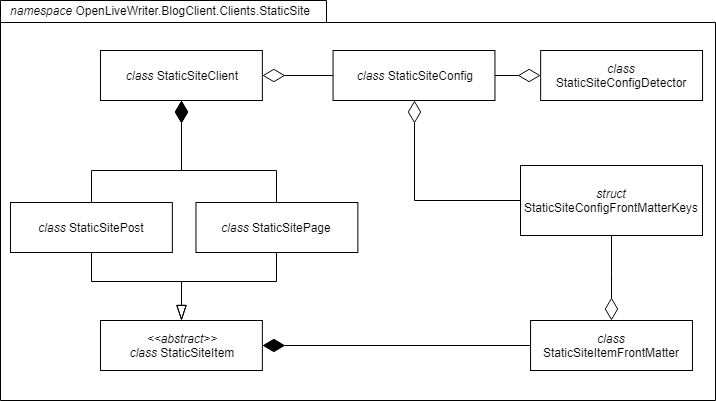

# Hacking - Static Site

The Static Site Generator support is split into various classes, as indicated by the class diagram below.

Please note that this diagram only describes classes created as part of the Static Site Generator implementation, and only classes in the `OpenLiveWriter.BlogClient.Clients.StaticSite` namespace. Other classes are implemented, such as wizard pages, which have been ommited from the above diagram.

## Class roles and descriptions

|Name|Role and description|Dependency summary|
|---|---|---|
|StaticSiteClient|Serves as the primary interface between Open Live Writer and the Static Site Generator support. Implements Blog functions such as CRUD on posts and pages.|<ul><li>Implements IBlogClient</li><li>Inherits BlogClientBase</li><li>Creates a private `StaticSiteConfig` and loads its contents from the provided `IBlogClientCredentialsAccessor` on initiation.</li></ul>|
|StaticSiteConfig|Defines and handles the storage and processing of configuration settings for the Static Site Generator support.|<ul><li>Instantiated in `StaticSiteClient`</li><li>Used-by-reference in `StaticSiteConfigDetector`.</li><li>Instantiates a `StaticSitePostFrontMatterKeys`, to be loaded from stored config values.</li></ul>|
|StaticSitePost|Represents a published or yet-to-be-published post to `StaticSiteClient`. Contains methods related to loading from disk, saving to disk, and generating safe on-disk slugs and IDs, as well as other functionality.|<ul><li>Contains a `BlogPost` (from `OpenLiveWriter.Extensibility.BlogClient`)</li><li>Generates a `StaticSitePostFrontMatter` on attribute request</li></ul></ul>|
|StaticSitePostFrontMatter|Defines and stores all possible static post front matter keys. Implements loading and saving from YAML, as well as loading and saving from a `OpenLiveWriter.Extensibility.BlogClient.BlogPost` instance.|<ul><li>Instantiated by `StaticSitePost` on request.</li><li>Retrieves and stores a `StaticSitePostFrontMatterKeys` from `StaticSiteConfig` on construction.</li></li></ul>|
|StaticSitePostFrontMatterKeys|A subset of the static site config, `StaticSitePostFrontMatterKeys` contains the key names for each of the supported front-matter attributes. Used to support different static site generators.|<ul><li>Instantiated by StaticSiteConfig.</li><li>Used-by-reference in StaticSitePostFrontMatter</li></ul>|