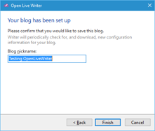

#Test Plan for Ensuring that Adding a Google works properly
Steps                 | Desired Results                | Complete | Comments
----------------------|--------------------------------|----------| --------
Click Home | | |
Click Options | | |
Click Account | | | 
Click Add | | |
Select Google Blogger | Ensure that dialog box matches below | | 
Click SignIn | Ensure that browser opens to google login | | 
Login to google | Ensure that user can allow OpenLiveWriter to use blogger and photos | | This is dependent on Google to some extent
 | Ensure verification code is received | | 
 | Ensure windows closes | | 
 | Ensure blogger account is set up | | 
 | Ensure "Your Blog has been setup" displays and matches below | |
Click on Privacy Policy | Ensure that browser opens to the privacy policy | | 
Click Cancel | Ensure that canceling works and user is returned to accounts dialog box | |
Click Add | | |
Select Google Blogger | Ensure that dialog box matches below | | 
Click SignIn | Ensure that browser opens to google login | | 
Login to google | Ensure that user can allow OpenLiveWriter to use blogger and photos | | This is dependent on Google to some extent
 | Ensure verification code is received | | 
 | Ensure windows closes | | 
 | Ensure blogger account is set up | | 
 | Ensure "Your Blog has been setup" displays and matches below | | 
Change the nickname | Ensure that changing the nickname works | |
Click Finish | Ensure that blog exists in accounts | |
 

