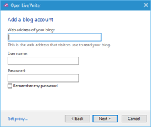
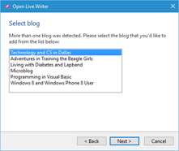

#Test Plan for Ensuring that Adding a Typepad account works properly
Steps                 | Desired Results                | Complete | Comments
----------------------|--------------------------------|----------| --------
Click Home | | |
Click Options | | |
Click Account | | | 
Click Add | | |
Select Other Services | Ensure that dialog box matches below | | 
Fill in the boxes incorrectly | Ensure that select blog type dialog box matches below | | 
Click Cancel | Ensure that the user is returned to the Accounts dialog box | |
Click Add | | |
Select Other Services | Ensure that dialog box matches below | | 
Fill in the first box incorrectly but enter a correct userid and password | Ensure that select blog type dialog box matches below | |
Select Typepad | | | 
Click Next | Ensure that all of the blogs for the associated username and password are displayed | |
Select a blog | | |
Click Next | Ensure that the blog is setup | | 
Click Cancel | Ensure that the user is returned to the Accounts dialog box | |
Click Add | | |
Select Typepad | Ensure that dialog box matches below | | 
Fill in the boxes correctly | According to how Typepad is configured, either all blogs or only the one will be displayed | | 
 | Ensure that downloading the theme is an option | | 
 | Ensure "Your Blog has been setup" displays and matches below | | 
Change the nickname | Ensure that changing the nickname works | |
Click Finish | Ensure that blog exists in accounts | |
 

