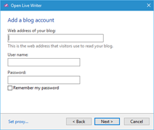
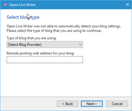
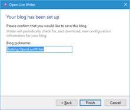

#Test Plan for Ensuring that adding a WordPress account works properly
Steps                 | Desired Results                | Complete | Comments
----------------------|--------------------------------|----------| --------
Click Home | | |
Click Options | | |
Click Account | | | 
Click Add | | |
Select Wordpress | Ensure that dialog box matches below | | 
Fill in the boxes incorrectly | Ensure that select blog type dialog box matches below | | 
Click Cancel | Ensure that the user is returned to the Accounts dialog box | |
Click Add | | |
Select Wordpress | Ensure that dialog box matches below | | 
Fill in the boxes correctly | Ensure WordPress account is set up | | 
 | Ensure that downloading the theme is an option | | 
 | Ensure "Your Blog has been setup" displays and matches below | | 
Change the nickname | Ensure that changing the nickname works | |
Click Finish | Ensure that blog exists in accounts | |
 

