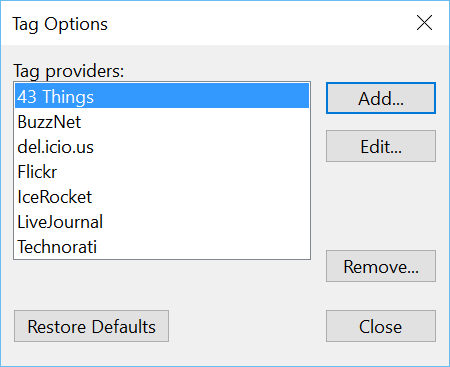

###Test Plan for Ensuring Add/Edit Tag Provider box works correctly
Steps                  | Desired Results                | Complete | Comments
--------------------------|--------------------------------------------|----------| --------
Open Live Writer | | | 
Click on Insert | | |
Click on Post Tags | | | 
Select (Customize Providers) from Provider drop down | Ensure Tag Options dialog box opens | |
Select a Provider | | | 
Click on Remove | Ensure provider is removed | |
Click on Close | Ensure dialog box closes | | 
  | Insert Tags dialog box appears | | 
Click on Providers | Ensure that provider was deleted | | 
Click on Restore Defaults | Ensure that providers are restored | |
Click on Close | Ensure dialog box closes | |
  | Insert Tags dialog box appears | |
Click on Providers | Ensure default providers exist | | 
Select (Customize Providers) from Provider drop down | Ensure Tag Options dialog box opens | |
Click Add | Ensure Create New Tag Provider dialog box appears | |
Add Provider name: | Ensure provider name appears in each appropriate field | |
| Ensure HTML preview changes | | 
Click OK | | | 
Click Close (Tag Options) | | | 
Add tag |  |  | 
Click Insert | | |
Click Source (on bottom) | Ensure that html was rendered correctly | |
Click on Post Tags | | | 
Select (Customize Providers) from Provider drop down | Ensure Tag Options dialog box opens | |
Click Edit  | | Ensure Edit *provider* dialog box appears
Change Provider name: | Ensure provider name appears in each appropriate field | |
| Ensure HTML preview changes | |
Click OK | | | 
Click Close (Tag Options) | | | 
Add tag |  |  | 
Click Insert | | |
Click Source (on bottom) | Ensure that html was rendered correctly | |
Click on Post Tags | | | 
Select (Customize Providers) from Provider drop down | Ensure Tag Options dialog box opens | |
Click Edit  | | Ensure Edit *provider* dialog box appears
Change HTML template: | Ensure template changes | |
| Ensure HTML preview changes
Click OK | | | 
Click Close (Tag Options) | | | 
Add tag |  |  | 
Click Insert | | |
Click Source (on bottom) | Ensure that html was rendered correctly | |
Click on Post Tags | | | 
Click Edit  | | Ensure Edit *provider* dialog box appears
Change Seperate the HTML field : | Ensure HTML preview changes | |
Click OK | | | 
Click Close (Tag Options) | | | 
Add tag |  |  | 
Click Insert | | |
Click Source (on bottom) | Ensure that html was rendered correctly | |
Click on Post Tags | | | 
Click Edit  | | Ensure Edit *provider* dialog box appears
Change HTML caption for tab list: | Ensure HTML preview changes | |
Click OK | | | 
Click Close (Tag Options) | | | 
Add tag |  |  | 
Click Insert | | |
Click Source (on bottom) | Ensure that html was rendered correctly | |
Click on Post Tags | | | 

