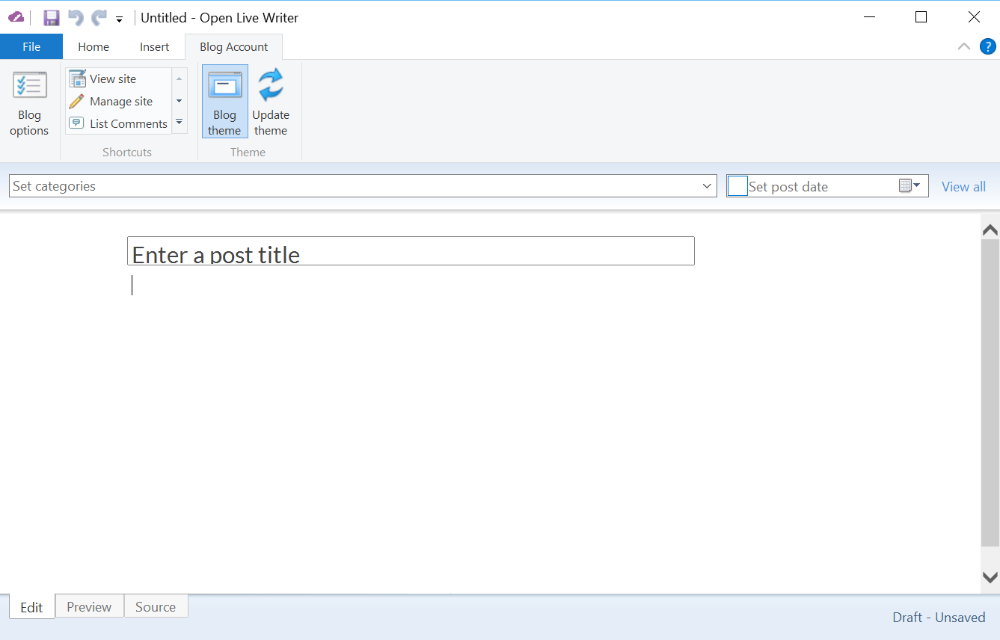

###Test Plan for Ensuring that OpenLiveWriter opens correctly
Steps                 | Desired Results                | Complete | Comments
----------------------|--------------------------------|----------| --------
OpenLiveWriter opens |  |   |
Click on Blog Account Tab | Compare results to below image | |
Check the following are present | Blog Options | | 
 | *Shortcuts*  | | 
 May have to use dropdown to see |   View Site  | | 
 |   Manage Site | | 
 |   List Comments | | 
 |   Edit design | |
 | *Theme* | | 
 |   Blog Theme | | 
 |   Update Theme | | 
 Hover on Blog Options | Message describing action appears | |
 Click on Blog Options | Blog Options Dialog box appears | |
 Hover on View site | Nothing | |
 Click on View Site | Browser optens to site default page | |
 Hover on View site | Nothing | |
 Click on Manage Site | Browser opens to site dashboard page | |
 Hover on List Comments | Nothing | |
 Click on List Comments | Browser opens to site comments page | | 
 Hover on Edit Design | Nothing | | 
 Click on Edit Design | Browser opens to site design page | |
 Hover on Blog Theme | Message describing action appears | | 
 Click on Blog Theme | Blog Theme is toggled -- either applies theme to page or default editor | | 
   | If blog theme is applied,icon is surrounded by blue box  | |
 Hover on Update Theme | Message describing action appears | | 
 Click on Update Theme | Downloading Blog Theme dialog box appears | |
            | Progress bar and dialog changes as blog theme is downloaded 
  

