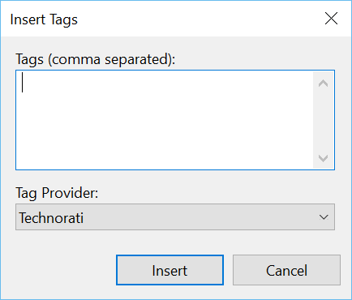
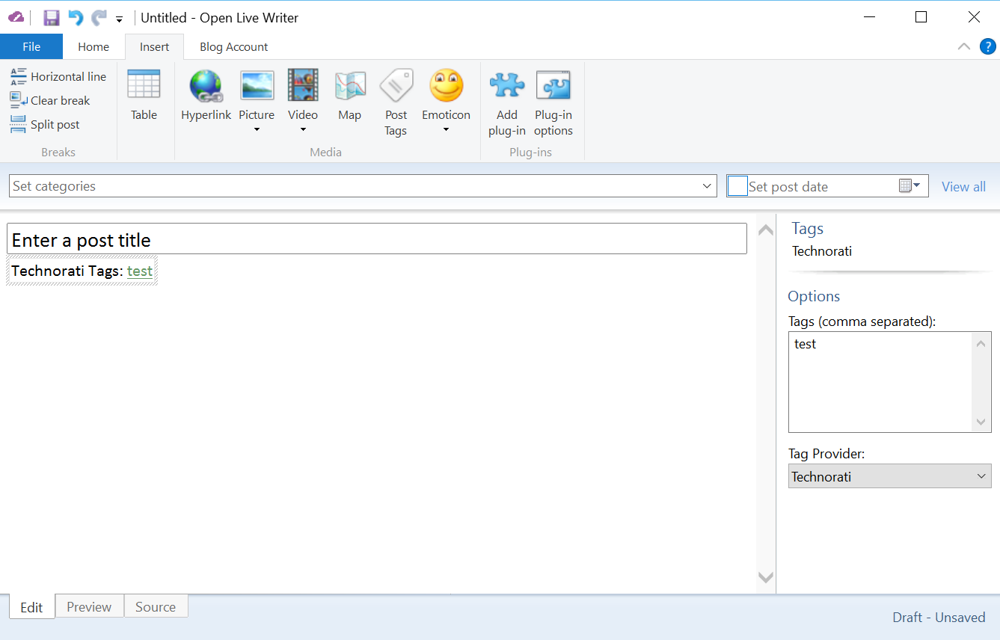

###Test Plan for Ensuring Insert Tags dialog box works correctly
Steps                  | Desired Results                | Complete | Comments
--------------------------|--------------------------------------------|----------| --------
Open Live Writer | | | 
Click on Insert | | |
Click on Post Tags | Ensure that Insert Tags dialog box matches image below  | | 
Enter tags | Ensure tags display properly | | 
Click on Insert | Ensure that tags are inserted and displayed as below | | 
Click on Post Tags | Ensure that Insert Tags dialog box matches image below   | | 
Click on drop box and select another provider | Ensure that dialog box displays correctly | | 
Enter tags | Ensure tags display properly
Click on Insert | Ensure that tags are inserted and displayed appropriately | |
Click on Insert | | |
Click on Post Tags | Ensure that Insert Tags dialog box displays as first image  | |
Click on Tag Provider | Ensure that Provider is updated appropriately | |
Click on Insert | Ensure that Provider is updated appropriately | |
Click on Tag hyperlink | Ensure that Tags displays on the right appropriately (see second image) | | 
Click off Tag hyperlink |Ensure that Tags box on side disappears | | 
Click on Post Tags | Ensure that Insert Tag dialog box displays as first image | | 
Click on Tab Provider | | | 
Scroll to Customize Provider | Ensure that Tag Options dialog box is displayed | |
Click Close | Dialog box closes
Click Cancel | Insert Tags dialog box closes

