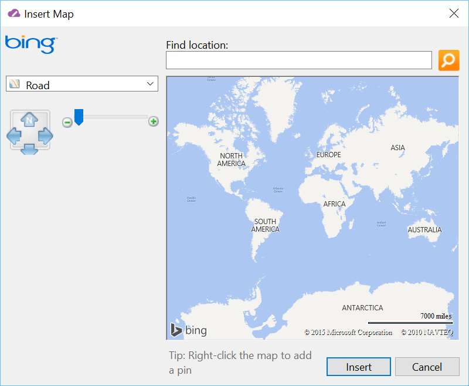

###Test Plan for Ensuring Insert Map dialog box works correctly
Steps                  | Desired Results                | Complete | Comments
--------------------------|--------------------------------------------|----------| --------
Open Live Writer | | | 
Click on Insert | | |
Click on Map | Observe the dialog box matches the below image | |
Click on dropdown and select Road | Observe that dialog box displays a road map | |
Click on dropdown and select Aerial | Observe that dialog box display an arial map | | 
Click on up arrow | Observe that map moves up | | |
Click on right arrow | Observe that map moves right | | |
Click on left arrow | Observe that map moves left | | |
Click ond down arrow | Observe that map moves down | | |
Slide slider | Observe that map zooms in and out appropriately | | |
Enter address is Find location: text box and click search | Observe that address is found | |
Right click on map and add push pin | Observe that push pin is added | |
Right click on map and click Zoom to city level | Observe that map zooms to city level | | 
Right click on map and click Zoom to region level | Observe that map zooms to region level | |
Right click on map and click Center map here | Observe that map centers correctly | | 
Click on cancel | Insert map dialog box closes | | 
Click on Map | | | 
Enter an address | | |
Click on insert | Observe that map is insered in post apprpriately

