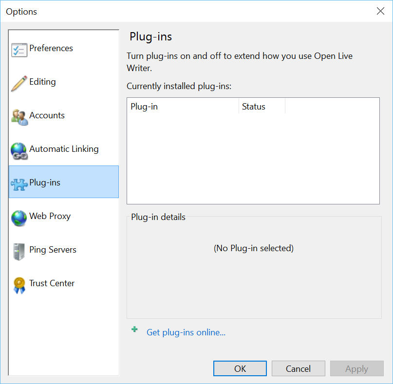

#Test Plan for Ensuring that Plug-In Options works properly
Steps                 | Desired Results                | Complete | Comments
----------------------|--------------------------------|----------| --------
Open Live Writer | | |
Click on Plug-in options | Ensure Options dialog box opens | |
| Ensure that Plug-ins tab is selected | | 
| Click Cancel | Ensure dialog box closes | | 
| Click on File Tab | |
| Click on Options | |
| Click on Plug-ins Tab | Ensure that Plug-ins tab is open and selected | |
| Observe below image | Ensure image matches | | 

See (../observePlugInOptions.md) for further testing