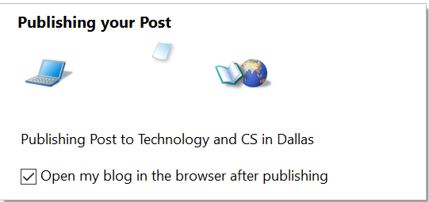

###Test Plan for Ensuring Publish dialog box works correctly
Steps                  | Desired Results                | Complete | Comments
--------------------------|--------------------------------------------|----------| --------
Open Live Writer  |   |  |
Click on File | | | 
Click on Publish |  | | 
Click on Yes | Publishing Your Post dialog box displayes | | 
While publishing observe Open my blog check | | |
if Checked | Blog should open at post | | |
if not Check | Ensure blog post was posted | | |
 | | | 
Click on Publish |  |  |
Toggle Check Box | Observe opposite behavior from above |  |

