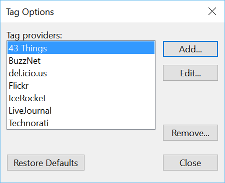

###Test Plan for Ensuring Tags Options box works correctly
Steps                  | Desired Results                | Complete | Comments
--------------------------|--------------------------------------------|----------| --------
Open Live Writer | | | 
Click on Insert | | |
Click on Post Tags | | | 
Select (Customize Providers) | Ensure Tag Options | |
Select a Tag provider : |
Click on Remove : Ensure that provder is no longer in the list | |
Click Close : Ensure box closes and Insert Tags dialog box opens | | 
   |  Ensure that provider is not in the Insert Tags Provider drop down list | |
Select (Customize Providers) | Ensure Tag Options | |
Click Restore Default | Ensure that all providers are in the list|
Click Close | Ensure that all default providers is not in the Insert Tags Provider drop down list | | 

