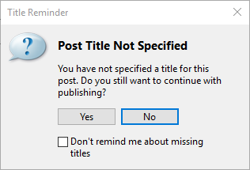

###Test Plan for Ensuring Title Reminder works correctly
Steps                  | Desired Results                | Complete | Comments
--------------------------|--------------------------------------------|----------| --------
Open Live Writer  |   |  |
Click on File | | | 
Click on Publish | Since blank post with no title, Title Reminder dialog box appears, see below | | | 
Click on checkbox for "Don't remind me about missing titles" | | | 
Click on No | 
Click on File | |
Click on Publish | Ensure that post is published without the Title Reminder box | |
 | | | |
Click on File | | |
Click on Options | | | 
Click on Preferences | | |
Click on View Post after Publishing | | |
Open Live Writer  |   |  |
Click on File | | | 
Click on Publish | Since blank post with no title, Title Reminder dialog box appears, see below | | | 

