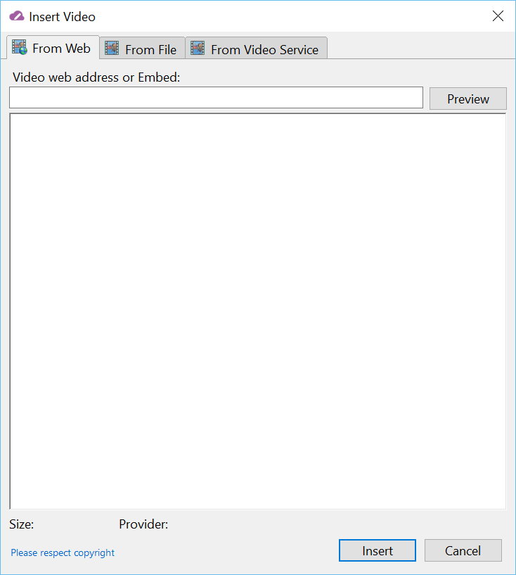
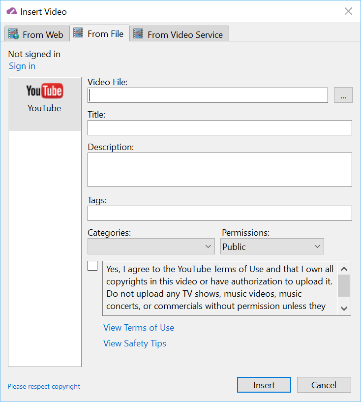
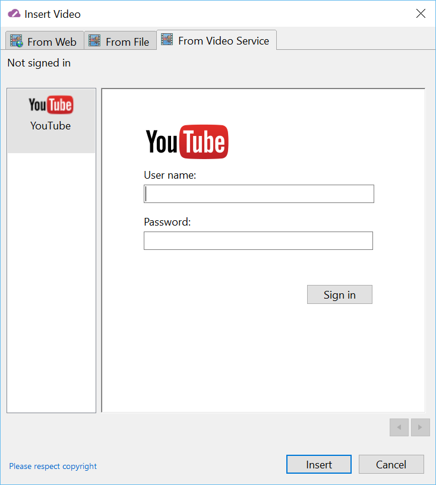

###Test Plan for Ensuring Video Dialog Boxes work correctly
Steps                  | Desired Results                | Complete | Comments
--------------------------|--------------------------------------------|----------| --------
Open Live Writer |  |  |
Click on Video | Ensure that three choices are available | | 
| From the web | |
| From your computer | | 
| From video service | |
Click on From the Web | Ensure Insert Video Dialog box opens | |
| Ensure From the Web Tab is open | |
| Ensure Insert Video From The web tab matches the below image | |
Click on From your computer | Ensure Insert Video Dialog box opens | |
| Ensure Insert Video From File is open | |
| Ensure Insert Video From File tab matches the below image | |
Click on From video service | Ensure Insert Video Dialog box opens | |
| Ensure Insert Video From Video Service is open | |
| Ensure Insert Video From Video Service tab matches the below image | |
Click on Insert tab | | |
Click on Video | Ensure that three choices are available | | 
| From the web | |
| From your computer | | 
| From video service | |
| | | |
Click on From the Web | Ensure Insert Video Dialog box opens | |
| Ensure From the Web Tab is open | |
| Ensure Insert Video From The web tab matches the below image | |
Click on From your computer | Ensure Insert Video Dialog box opens | |
| Ensure Insert Video From File is open | |
| Ensure Insert Video From File tab matches the below image | |
Click on From video service | Ensure Insert Video Dialog box opens | |
| Ensure Insert Video From Video Service is open | |
| Ensure Insert Video From Video Service tab matches the below image | |

 

  