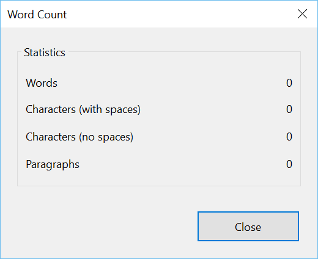

###Test Plan for Ensuring File Tab displays correctly
Steps                  | Desired Results                | Complete | Comments
--------------------------|--------------------------------------------|----------| --------
Open Open Live Writer  |  |  |
Live writer should be at home tab | | |
Post should be a new blank post | | |
Click on Word Count (In editing section, top icon) | Observe the below image, with 0 counts | |
Add title to blog post | | |
Click on Word Count (In editing section, top icon) | Observe the below image, with 0 counts | |
Add one word to blog post | | |
Click on Word Count (In editing section, top icon) | Ensure word counts are correct | |
Add paragraph to blog post | | | 
Add one word to blog post | | |
Click on Word Count (In editing section, top icon) | Ensure word counts are correct | |

  