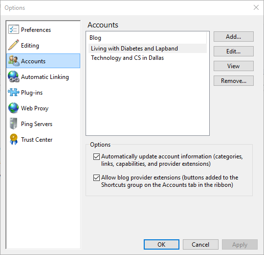

###Test Plan for Ensuring Automatic Linking dialog box displays correctly
Steps                  | Desired Results                | Complete | Comments
--------------------------|--------------------------------------------|----------| --------
Open Open Live Writer  |  |  |
Click on File | | | 
Click on Options | | |
Click on Accounts | Ensure that Accounts tab is selected and matches below | |
Unselect checkbox "Automatically update account information " | | 
Click on OK | | 
Click on File | | | 
Click on Options | | |
Click on Accounts | Ensure that checkbox "Automatically ... " is unchecked | |
Select checkbox "Automatically update account information " | | 
Click on OK | | 
Click on File | | | 
Click on Options | | |
Click on Accounts | Ensure that checkbox "Automatically ... " is checked | |
Click on File | | | 
Click on Options | | |
Click on Accounts | Ensure that Accounts tab is selected and matches below | |
Unselect checkbox "Allow blog provider extensions" | | 
Click on OK | | 
Click on File | | | 
Click on Options | | |
Click on Accounts | Ensure that checkbox "Automatically ... " is unchecked | |
Select checkbox "Allow blog provider extensions" | | 
Click on OK | | 
Click on File | | | 
Click on Options | | |
Click on Accounts | Ensure that checkbox "Allow blog provider extensions " is checked | |
Click on a Blog Account | | |
Click on View | Ensure that browser opens at blog main page | | 
Click on Edit | Ensure that Blog Options dialog box opens with current blog options | |
Click on Cancel | 
Click on Add | Ensure that Add a blog account dialog box opens | | 
Click on Cancel |
Click on Remove | Ensure that "Are yu sure you want to remove this blog from Writer? appears | | 
Click on No | Ensure that message box closes and no changes to accounts is made | | 
Click on Remove | Ensure that "Are yu sure you want to remove this blog from Writer? appears | | 
Click on Yes | Ensure that blog account is deleted | | 
Click on OK |
Click on File | | |
Click on Options | | | 
Click on Accounts | Ensure proper accounts are listed | | 

