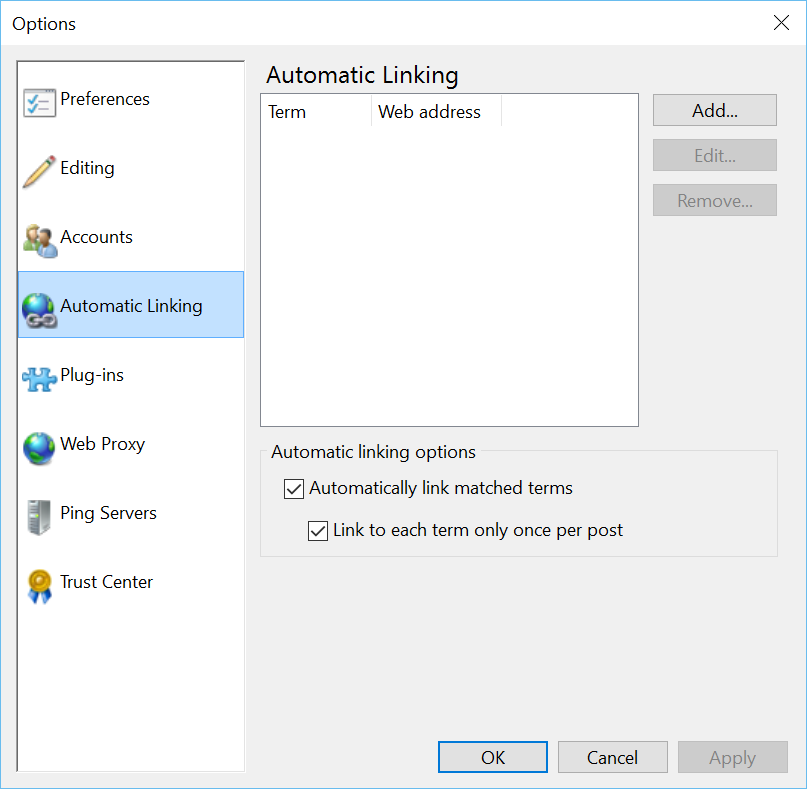
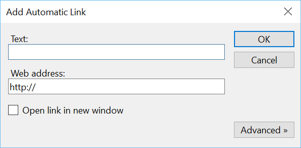

###Test Plan for Ensuring Automatic Linking dialog box displays correctly
Steps                  | Desired Results                | Complete | Comments
--------------------------|--------------------------------------------|----------| --------
Open Open Live Writer  |  |  |
Click on File | | | 
Click on Options | | |
Click on Automatic Linking | Ensure dialog box matches below, note that you may have entries | | 
Toggle Automatic Linking Options to off | Ensure that link is greyed out | |
Click on Cancel | | |
Click on File | | | 
Click on Options | | | 
Click on Automatic Linking | Ensure that both Automatic Linking and Link to Each Term is on | | *This seems to be default behavior*
Toggle off Link to Each Term | | |
Click Apply | Ensure that dialog box stays the same | |
Click OK | | | 
Click on File | | | 
Click on Options | | | 
Click on Automatic Linking | Ensure that both Automatic Linking is on and Link to Each Term is off | | 
Click off Automatically Link | |
Click on Ok | | |
Click on File | | | 
Click on Options | | | 
Click on Automatic Linking | Ensure that both Automatic Linking is off and Link to Each Term is off | | 
Toggle Automatically Link to On | Ensure that Automatic Linking is on and Link to Each Term is on | |
Click on OK | | | 
Click on File | | | 
Click on Options | | | 
Click on Automatic Linking | Ensure that both Automatic Linking is on and Link to Each Term is on | | 
Click on OK | | |
| | | |
Click on Add | Ensure Add Automatic Link dialog appears and matches below | |
Click OK | Ensure error message appears - Enter the text to display hyperlink | | 
Add Text | Ensure it appears | | 
Click OK | Ensure error message appears - Enter a valid hyperlink | | 
Add valid hyperlink | Ensure it appears | |
Click OK | Ensure the new information appears on the Automatic Linking Dialog Box and it is highlighted | |
Click on Edit | Ensure Edit Automatic Link Dialog box appears (same as add, only edit in title) | |
| Ensure information is correct | | 
Edit text | Ensure information is changed | | 
Edit hyperlink | Ensure information is changed | | 
Click OK | Ensure new information is in Automatic Link Dialog box | | 
 | Ensure that that current entry is highlighted | | 
Click on Edit | Ensure Edit Automatic Link Dialog box appears (same as add, only edit in title) | |
Click on Cancel | Ensure that box closes | |
 | Ensure that current entry is highlighted | | 
 | Ensure that entry does not change | | 

