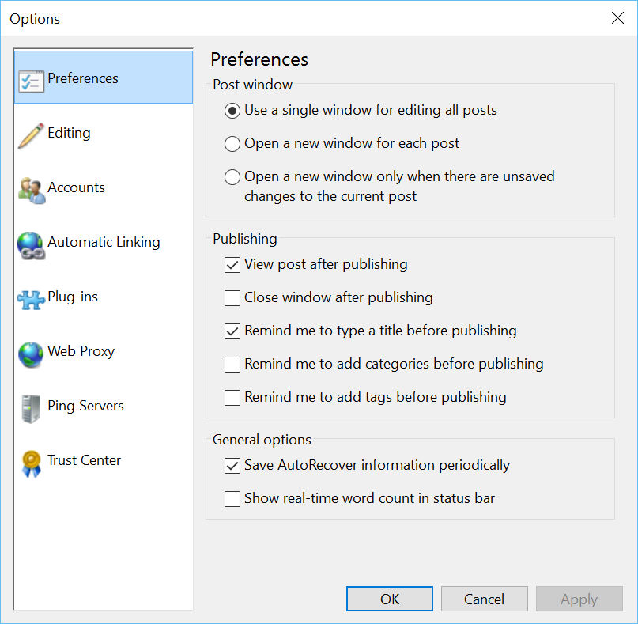

###Test Plan for Ensuring Options Preferences dialog box displays correctly
Steps                  | Desired Results                | Complete | Comments
--------------------------|--------------------------------------------|----------| --------
Open Open Live Writer  |  |  |
Click on File | | | 
Click on Options | | |
Click on Preferences | Ensure that the dialog box matches image below  | | *Note that this is the default when selecting options*
**Test Post Window** | | | 
Deselect all check boxes | | |
Click Apply | | | 
Select "Use a single window .." | | |
Click OK | | | 
Click on File | | | 
Click on Options | | |
Click on Preferences | Ensure that the dialog box has only the radio box "Use a single window"  | | 
Click on OK | | |
Have an empty post | | | 
Click on New Post | Ensure stays in the same window | |
Start a blog post | | | 
Click on New Post | Ensure that dialog box to save post displays | | 
Save Post | Ensure windows stays open with a blank post | | 
Click on File | | | 
Click on Options | | |
Click on Preferences | Ensure that the dialog box matches image below  | | *Note that this is the default when selecting options*
Select "Open a new window for each post" | | |
Click on OK | | | 
Click on New Post | Ensure that another Open Writer windows opens | | 
Click on File | | | 
Click on Options | | |
Click on Preferences | Ensure only "Open a new window for each post" is selected | |
Click on OK | | |
Create a new post | | | 
Save it | | | 
Click on File | | |
Click on New Post | Ensure that saved post is closed and new post is in the same window | | 
**Test Publishing ** | | |
Click on File | | |
Click on Options | | |
Click on Preferences | | | Appears to be default behavior
Select Radio button "Open a new window for each post" | | | Appears to be default behavior
Select "View Post after publishing | | |
Deselect all other check boxes | | | 
Click OK | | |
Write a blog post | | | 
Publish | Observe blog post open in browswer window | | |  
Click on File | | |
Click on Options | | |
Click on Preferences | | | Appears to be default behavior
Select Radio button "Open a new window for each post" | | | Appears to be default behavior
DeSelect "View Post after publishing | | |
Deselect all other check boxes | | | 
Click OK | | |
Edit blog post | | | 
Publish | Observe that blog post does not open in browswer window | | |  
Click on File | | |
Click on Options | | |
Click on Preferences | | | Appears to be default behavior
Select Radio button "Open a new window for each post" | | | Appears to be default behavior
Select "Close window after publishing | | |
Deselect all other check boxes | | | 
Click OK | | |
Write a blog post | | | 
Publish | Observe Windows Writer window close after publishing  | | |  
Click on File | | |
Click on Options | | |
Click on Preferences | | | Appears to be default behavior
Select Radio button "Open a new window for each post" | | | Appears to be default behavior
Deselect "Close window after publishing| | |
Delect all other check boxes | | | 
Click OK | | |
Edit blog post | | | 
Publish | Observe that Windows Live Explorer remains open | | |  
| | | 
Click on File | | |
Click on Options | | |
Click on Preferences | | | Appears to be default behavior
Select Radio button "Open a new window for each post" | | | Appears to be default behavior
Select "Close window after publishing" | | |
Deselect all other check boxes | | | 
Click OK | | |
Write a blog post | | | 
Publish | Observe Open Live Writer window closes after publishing  | | |  
Click on File | | |
Click on Options | | |
Click on Preferences | | | Appears to be default behavior
Select Radio button "Open a new window for each post" | | | Appears to be default behavior
Deselect "Close window after publishing" | | |
Delect all other check boxes | | | 
Click OK | | |
Edit blog post | | | 
Publish | Observe that Open Live Writer window remains  | | |  
| | | 
Click on File | | |
Click on Options | | |
Click on Preferences | | | Appears to be default behavior
Select Radio button "Open a new window for each post" | | | Appears to be default behavior
Select "Remind me to type a title before publishing" | | |
Deselect all other check boxes | | | 
Click OK | | |
Write a blog post - omit the title | | | 
Publish | Observe title reminder message box | | |  
Click on File | | |
Click on Options | | |
Click on Preferences | | | Appears to be default behavior
Select Radio button "Open a new window for each post" | | | Appears to be default behavior
Deselect "Remind me to type a title before publishing" | | |
Delect all other check boxes | | | 
Click OK | | |
Edit blog post | | | 
Publish | Observe no title reminder | | |  
| | | 
Click on File | | |
Click on Options | | |
Click on Preferences | | | Appears to be default behavior
Select Radio button 'Remind me to add categories before publishing" | | | Appears to be default behavior
Select "Close window after publishing | | |
Deselect all other check boxes | | | 
Click OK | | |
Write a blog post omitting categories | | | 
Publish | Observe missing categories dialog box  | | |  
Click on File | | |
Click on Options | | |
Click on Preferences | | | Appears to be default behavior
Select Radio button "Remind me to add categories before publishing" | | | Appears to be default behavior
Deselect "Close window after publishing| | |
Delect all other check boxes | | | 
Click OK | | |
Edit blog post | | | 
Publish | Observe no categories message box | | |  
| | |
Click on File | | |
Click on Options | | |
Click on Preferences | | | Appears to be default behavior
Select Radio button "Remind me to add tags before publishing"  | | | Appears to be default behavior
Select "Close window after publishing | | |
Deselect all other check boxes | | | 
Click OK | | |
Write a blog post | | | 
Publish | Observe Observe missing tag dialog box  | | |  
Click on File | | |
Click on Options | | |
Click on Preferences | | | Appears to be default behavior
Select Radio button "Remind me to add tags before publishing" | | | Appears to be default behavior
Deselect "Close window after publishing| | |
Delect all other check boxes | | | 
Click OK | | |
Edit blog post | | | 
Publish | Observe no tag message box | | |  
| | | 
**Test General Options** | | | 
Click on File | | |
Click on Options | | |
Click on Preferences | | | Appears to be default behavior
Select Radio button "Open a new window for each post" | | | Appears to be default behavior
Select "Save AutoRecover information periodically" | | |
Click OK | | |  
Click on File | | |
Click on Options | | |
Click on Preferences | Observe Save Autorecover check | | 
Click on File | | |
Click on Options | | |
Click on Preferences | | | Appears to be default behavior
Select Radio button "Open a new window for each post" | | | Appears to be default behavior
Select "Show real-time word count in status bar" | | |
Click OK | | |  
Click on File | | |
Click on Options | | |
Click on Preferences | Observe Save Autorecover check | | 
Click on OK | | |
Write blog post | Ensure word count is updated | | 

