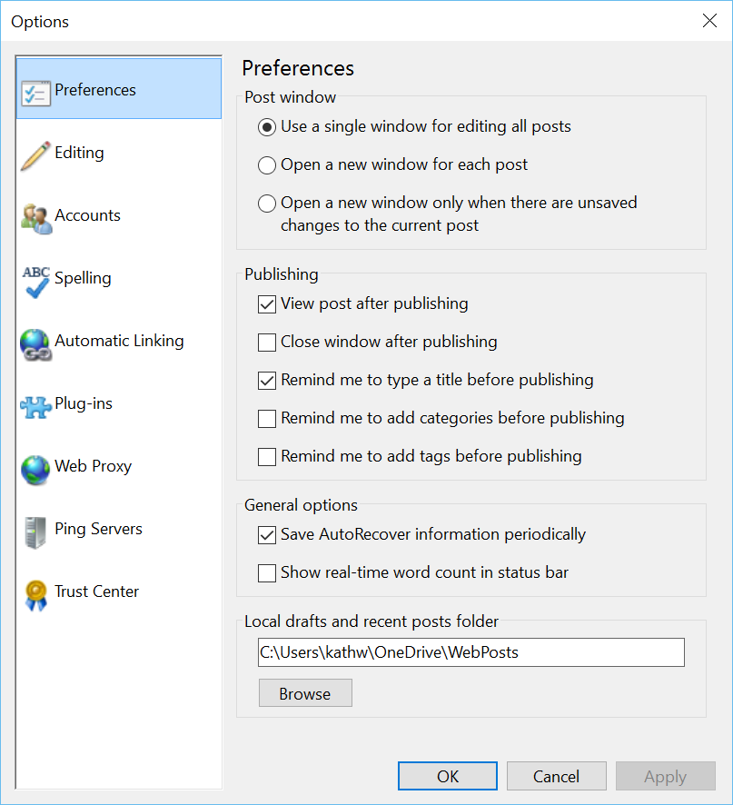
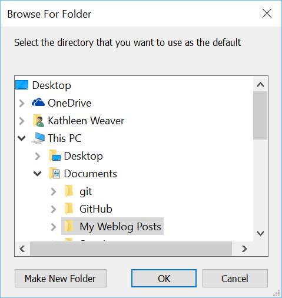

###Test Plan for Ensuring Options Preferences dialog box displays correctly
Steps                  | Desired Results                | Complete | Comments
--------------------------|--------------------------------------------|----------| --------
Open Open Live Writer  |  |  |
Click on File | | | 
Click on Options | | |
Click on Preferences | Ensure that the dialog box matches image below  | | *Note that this is the default when selecting options*
Click on Browse (under Local drafts)| Ensure that the browse for folder dialog box matches image beloww | |
Click on Cancel | | | 
Click on Cancel | | |
Click on Options | Ensure that preferences dialog is selected | |
Click on Browse (under Local drafts) | | |
Select a different folder (existing) | | | 
Click OK | Ensure that local draft folder has changed | | 
Click OK | Ensure that message box matches below  | | 
Click No | | | 
Click On File | | | 
Click on Options | | |
Click on Preferences | Ensure that new folder is displayed | | 
Click on Browse | | |
Expand Directory | Ensure two directories were created | |
| Drafts | | 
| Recent Posts | | 
Reverse directory choice (pick the original one) | | |
Click Apply | | |
Click OK | | | If there are no posts saved, no offer to save is made | | 
Click On File | | | 
Click on Options | | |
Click on Preferences | Ensure that new folder is displayed | | 
Click on Browse | | |
Expand Directory | Ensure two directories were created | |
| Drafts | | 
| Recent Posts | | 
Reverse directory choice (pick the original one) | | |
Click Apply | | |
Click OK | | | If there are posts, the posts should be moved. 

