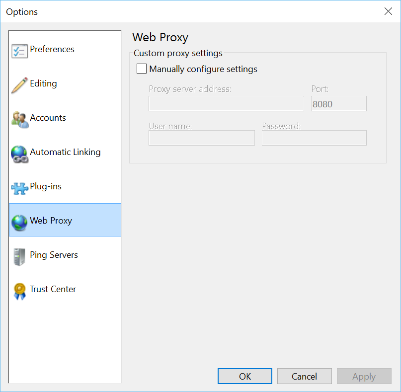

###Test Plan for Ensuring Web Proxy tab works correctly
Steps                  | Desired Results                | Complete | Comments
--------------------------|--------------------------------------------|----------| --------
Open Open Live Writer  |  |  |
Click on File | | | 
Click on Options | | |
Click on Web Proxy | Ensure Web Proxy dialog box matches below | |
Toggle checkbox to off | Ensure text block is grayed out | |
Toggle checkbox to on | Ensure settings boxes are white and available for editing | |
Enter at least one setting | |  |
Click Cancel | | | 
Click File | | |
Click Options | | |
Click Web Proxy | Changes should not have been retained | | |
Enter all settings | | |
Click Apply | Ensure that changes were made | | 
Click OK | Options dialog box closes | | 
Click File | | |
Click Options | | | 
Click Web Proxy | Changes should have been retained | | 
  
  Note: Currently no error checking is done, this only saves what the user put in.
  

